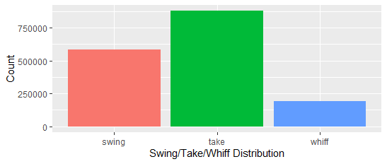

# Predicting Baseball Hitter Swing/Take/Whiff - Final Report
ORIE 4741 Course Project for FA20

Gary (Hancheng) Li

## Project Overview
The goal of this project is to predict whether a hitter in Major League Baseball will swing (and make contact), take (doesn't swing), or whiff (swing and miss) at a certain pitch, based on the hitter's hitting tendencies, the pitch characteristics, as well as the game situation (number of outs in an inning, number of runners on base). Ideally, I hope to build a model that can suggest to the pitcher what types of pitches to use against a certain hitter, as well as finding out the most important factors that influence swing/take/miss which can help with prospect scouting and development.

This project primarily uses R v4.0.3 as the coding language.

## Dataset Preparation

### Downloading the dataset
The original dataset is obtained from the [Baseball Savant](https://baseballsavant.mlb.com/) website using its powerful Statcast search feature. This dataset is maintained by Major League Baseball R&D Department, and contains detailed play-by-play information from the 2019 MLB Season. In the midterm report, I used data from the 2017 to 2019 MLB Seasons, but the dataset is way too large for fitting the models in reasonable time, so I changed to use only one year's data instead. Each row corresponds to a single pitch thrown, while the columns contain information such as player IDs, player handedness, pitch type, pitch location, pitch velocity, spin rate, batted ball type, and other numeric, nominal or descriptive variables. The full list of variables are listed [here](https://baseballsavant.mlb.com/csv-docs). The original dataset is loaded into the R environment using the `baseballr` package developed by Bill Petti ([link](http://billpetti.github.io/baseballr/)), and contains 743,572 rows and 90 columns.

### Initial Processing

The dataset is well maintained with very few data quality issues. For the data cleaning process, I removed several deprecated columns including `spin_dir`, `break_angle_deprecated`, etc., corresponding to metrics that are no longer tracked and used. I also removed columns that I believe are irrelevant to the prediction, including `des` (which is the full description of each play, such as "Mike Trout homers (1) on a fly ball to center field"), and `umpire` (which is supposed to be the home plate umpire but the entire column is empty). Apart from this, the only issue I found with the dataset is that there are some pitches (very rare) that were thrown with 3 outs already recorded in the inning, which is impossible to happen based on the rules of the game (if 3 outs have already been recorded then the inning immediately stops, any pitch can only be thrown with 0, 1, or 2 outs recorded). I simply removed these rows from the dataset.

Next, I coded the response variable column ("swing", "take", or "whiff") using the `description` column. There are 17 different types of events in the `description` column. I first removed all the rows related to bunts, since they are not considered as typical swings where the hitter *reacts* to the pitch thrown. Then, I categorized the remaining types of events into "swing", "take" and "whiff" accordingly.

### Aggregating the Dataset to Obtain More Information

To capture the "hitting tendency" of the hitter, I performed data manipulation on the current dataset to obtain information about the historical swing/take/whiff percentages for each hitter in each zone. The `zone` column in the dataset is a column with integer values from 1 to 14, corresponding to 14 sections within and around the strike zone (as seen in this [zone chart](./Pics/zone.png)). I grouped by different players and aggregated their performances for each zone, for example, a player has a 0.543 swing rate, 0.348 take rate, and 0.109 whiff rate in zone 1. This information is added as additional columns to the dataset and used as predictors.

An important note here is that since there are many number of hitters who hasn't played a lot and have only seen very few pitches, their tendency calculations would be messed up. For example, if a hitter has only seen 20 pitches all year, then the swing/take/whiff percentages are highly likely to **not** be representative of the hitter's true tendencies. Because of this, I only included hitters that have seen more than 1,000 pitches during the 2019 Season. There are a total of 319 hitters who have seen more than 1,000 pitches, totaling 583,581 pitches which is still quite enough for this analysis. The dataset now has 583,581 rows and 41 columns.

### Final Bits

Finally, I prepared an alternative dataset with the same information, but performed one-hot encoding on the categorical variables, as well as standardizing all the columns for them to have mean 0 and variance 1. This alternative dataset has 58 columns and is used for specific algorithms that require only numeric columns and standardized values, such as K-Nearest Neighbors. This one-hot-encoded dataset has 583,581 rows and 58 columns. I also divided the dataset into a 80%-20% training-test split using the `createDataPartition` function from the `caret` package. Data pre-processing is complete at this point.

## Exploratory Analysis

I produced the following plots to explore the dataset. 

### Class Distribution

The first thing I decided to look at was the distribution of the 3 classes. I created the following plot based on the different "[zones](./Pics/zone.png)" around the strike zone. It is obvious from the plot below that within the strike zone (zones 1 to 9)

### Regarding Pitch Location

MLB hitters are trained to attack and swing at pitches in the strike zone, and take pitches outside of the strike zone. This means that swing or take behavior can very largely be affected by the location of the pitch. I made the following plot to show the relationship between pitch location and the swing+whiff rate. The white box shown is the strike zone (the area for zones 1 to 9 in the [zone chart](./Pics/zone.png)).

This tells us that the pitch location is quite important when it comes to deciding whether or not a hitter will take a pitch, with very few outliers.

### Regarding Pitch Velocity, Spin Rate and Pitch Movement

Based on previous baseball statistical analyses (such as [[1]](https://prospects365.com/2020/01/01/redefining-the-80-grade-fastball-spin-efficiency-spin-axis-and-movement-profile/), [[2]](https://www.drivelinebaseball.com/2019/01/deeper-dive-fastball-spin-rate/), [[3]](https://www.youtube.com/watch?v=hpIs__45t5I)), pitch velocity and spin rate is an important factor in inducing the hitter to swing-and-miss. This is mostly because a high spin rate can create significant horizontal or lateral movement of the baseball, which has an effect of tricking the hitter, and a high velocity means that hitters have less time to react and adjust to the pitch. I decided to take a look at the `release_speed` and `release_spin_rate` and how it's related to swing-and-miss rate. The plots are shown below for two of the most common pitch types: the 4-Seam Fastball, and the Curveball.

As shown above, we can see the swing-and-miss rate for both types of pitches is trending up with higher velocity and spin rate. Notice there are outliers with abnormally high whiff rates, but these areas contain very few pitches, so they are rather infrequent.

I also made similar plots for horizontal and vertical movement of the pitch. They tell a similar story: more horizontal/vertical movement leads to more swing-and-misses. To save space I'll not show them directly in the report, but here are the links: [4-Seam Fastball Movement](./Pics/4sfbmove.png), [Curveball Movement](./Pics/cumove.png).

## Initial Models

## Next Steps
Going forward with the project, there are a few things I plan to do:
* Build multiple different models with different subsets of columns selected and compare. This way, I can understand how including (or not including) different factors influence the quality of the model.
* Build a more complex and robust model using the XGBoost algorithm, and fine tune the model by testing out multiple different combinations of parameters.
* Dig deeper to analyze the results by investigating the following: How are the models performing on different classes? Is the accuracy rate for one class noticeably better/worse than another? How is the model performing for different pitch types, or different locations around the strike zone?
* Based on the previous questions, make pretty plots to visualize the results.
