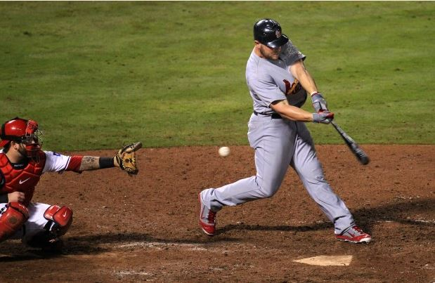
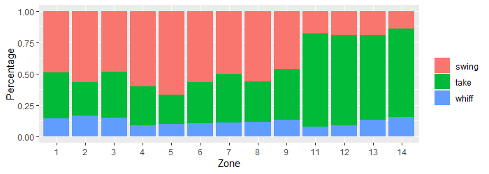
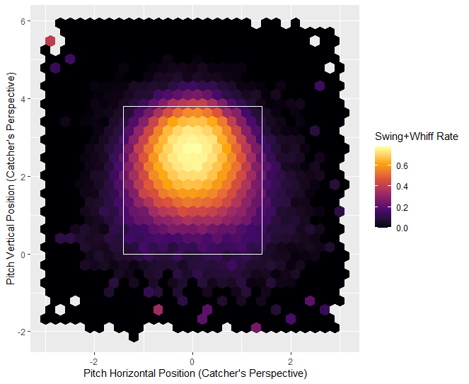
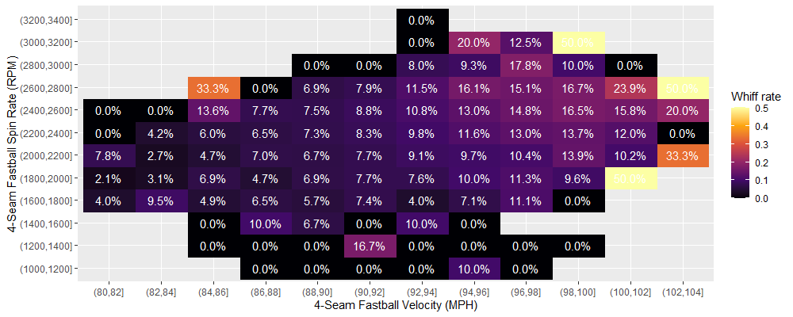
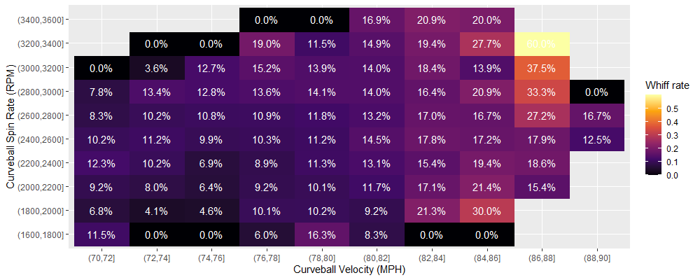
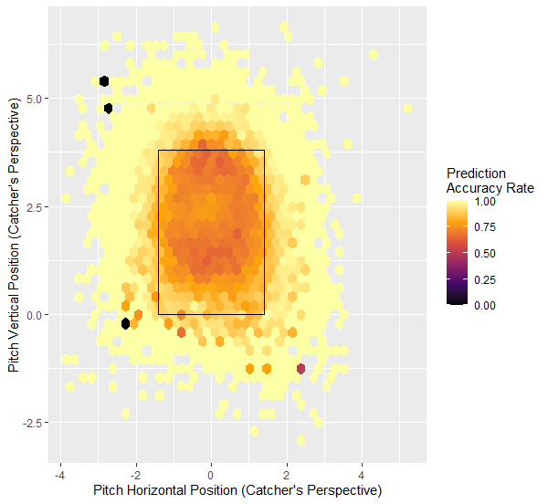
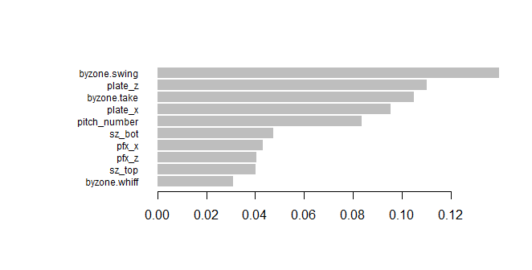

# Predicting Baseball Hitter Swing/Take/Whiff - Final Report
ORIE 4741 Course Project for FA20

Gary (Hancheng) Li

**Pages: 8 + 1 extra (as organized in final.docx which is also included in the repo), Word Count: 12**

## Project Overview

*For readers not familiar with baseball, please scroll down to the bottom of the report for a quick explanation of baseball pitching and hitting.*

The goal of this project is to predict whether a hitter in Major League Baseball will swing (and make contact), take (doesn't swing), or whiff (swing and miss) at a certain pitch, based on the hitter's hitting tendencies, the pitch characteristics, as well as the game situation (number of outs in an inning, number of runners on base). Ideally, I hope to build a model that can suggest to the pitcher what types of pitches to use against a certain hitter, as well as finding out the most important factors that influence swing/take/miss which can help with prospect scouting and development.

This project primarily uses R v4.0.3 as the coding language.

## Dataset Preparation

#### Downloading the dataset
The original dataset is obtained from the [Baseball Savant](https://baseballsavant.mlb.com/) website using its powerful Statcast search feature. This dataset is maintained by Major League Baseball R&D Department, and contains detailed play-by-play information from the 2019 MLB Season. In the midterm report, I used data from the 2017 to 2019 MLB Seasons, but the dataset is way too large for fitting the models in reasonable time, so I changed to use only one year's data instead. Each row corresponds to a single pitch thrown, while the columns contain information such as player IDs, player handedness, pitch type, pitch location, pitch velocity, spin rate, batted ball type, and other numeric, nominal, or descriptive variables. The full list of variables are listed [here](https://baseballsavant.mlb.com/csv-docs). The original dataset is loaded into the R environment using the `baseballr` package developed by Bill Petti ([link](http://billpetti.github.io/baseballr/)), and contains 743,572 rows and 90 columns.

#### Initial Processing

The dataset is well maintained with very few data quality issues. For the data cleaning process, I removed several deprecated columns including `spin_dir`, `break_angle_deprecated`, etc., corresponding to metrics that are no longer tracked and used. I also removed columns that I believe are irrelevant to the prediction, including `des` (which is the full description of each play, such as "Mike Trout homers (1) on a fly ball to center field"), and `umpire` (which is supposed to be the home plate umpire but the entire column is empty). Apart from this, the only issue I found with the dataset is that there are some pitches (very rare) that were thrown with 3 outs already recorded in the inning, which is impossible to happen based on the rules of the game (if 3 outs have already been recorded then the inning immediately stops, any pitch can only be thrown with 0, 1, or 2 outs recorded). I simply removed these rows from the dataset.

Next, I coded the response variable column ("swing", "take", or "whiff") using the `description` column. There are 17 different types of events in the `description` column. I first removed all the rows related to bunts, since they are not considered as typical swings where the hitter *reacts* to the pitch thrown. Then, I categorized the remaining types of events into "swing", "take" and "whiff" accordingly.

#### Aggregating the Dataset to Obtain More Information

To capture the "hitting tendency" of the hitter, I performed data manipulation on the current dataset to obtain information about the historical swing/take/whiff percentages for each hitter in each zone. The `zone` column in the dataset is a column with integer values from 1 to 14, corresponding to 14 sections within and around the strike zone (as seen in this [zone chart](./Pics/zone.png)). I grouped by different players and aggregated their performances for each zone, for example, a player has a 0.543 swing rate, 0.348 take rate, and 0.109 whiff rate in zone 1. This information is added as additional columns to the dataset and used as predictors.

An important note here is that since there are many number of hitters who hasn't played a lot and have only seen very few pitches, their tendency calculations would be messed up. For example, if a hitter has only seen 20 pitches all year, then the swing/take/whiff percentages are highly likely to **not** be representative of the hitter's true tendencies. Because of this, I only included hitters that have seen more than 1,000 pitches during the 2019 Season. There are a total of 319 hitters who have seen more than 1,000 pitches, totaling 583,581 pitches which is still quite enough for this analysis. The dataset now has 583,581 rows and 41 columns.

#### Final Bits

Finally, I prepared an alternative dataset with the same information, but performed one-hot encoding on the categorical variables, as well as standardizing all the columns for them to have mean 0 and variance 1. This alternative dataset has 58 columns and is used for specific algorithms that require only numeric columns and standardized values, such as K-Nearest Neighbors. This one-hot-encoded dataset has 583,581 rows and 58 columns. I also divided the dataset into a 80%-20% training-test split using the `createDataPartition` function from the `caret` package. Data pre-processing is complete at this point.

## Exploratory Analysis

I produced the following plots to explore the dataset. 

#### Class Distribution

The first thing I decided to look at was the distribution of the 3 classes. I created the following plot based on the different "[zones](./Pics/zone.png)" around the strike zone. It is obvious from the plot below that the three classes are not evenly distributed. Overall, about 50% of the pitches are taken, then 40% of the pitches are swung at and contact was made, only around 10% are swings-and-misses.

#### Regarding Pitch Location

MLB hitters are trained to attack and swing at pitches in the strike zone, and take pitches outside of the strike zone. This means that swing or take behavior can very largely be affected by the location of the pitch. I made the following plot to show the relationship between pitch location and the swing+whiff rate. The white box shown is the strike zone (the area for zones 1 to 9 in the [zone chart](./Pics/zone.png)).

This tells us that the pitch location is quite important when it comes to deciding whether or not a hitter will take a pitch, with very few outliers.

#### Regarding Pitch Velocity, Spin Rate and Pitch Movement

Based on previous baseball statistical analyses (such as [[1]](https://prospects365.com/2020/01/01/redefining-the-80-grade-fastball-spin-efficiency-spin-axis-and-movement-profile/), [[2]](https://www.drivelinebaseball.com/2019/01/deeper-dive-fastball-spin-rate/), [[3]](https://www.youtube.com/watch?v=hpIs__45t5I)), pitch velocity and spin rate are important factors when trying to induce the hitter to swing-and-miss. This is because a high spin rate can create significant horizontal or lateral movement of the baseball, which has an effect of tricking the hitter, and a high velocity means that hitters have less time to react and adjust to the pitch. I decided to take a look at the `release_speed` and `release_spin_rate` and how it's related to swing-and-miss rate. The plots are shown below for two of the most common pitch types: the 4-Seam Fastball, and the Curveball.

As shown above, we can see the swing-and-miss rate for both types of pitches is trending up with higher velocity and spin rate. Notice there are outliers with abnormally high whiff rates, but these areas contain very few pitches, so they are rather infrequent.

I also made similar plots for horizontal and vertical movement of the pitch. They tell a similar story: more horizontal/vertical movement leads to more swing-and-misses. To save space I'll not show them directly in the report, but here are the links: [4-Seam Fastball Movement](./Pics/4sfbmove.png), [Curveball Movement](./Pics/cumove.png).

## Model Fitting

For this project, I decided to use two different models, one is a relatively simple model learned in class, and the other one is a more complex and powerful model that achieves good prediction accuracy.

#### Support Vector Machines

I first tried out the one-vs-all Support Vector Machines model. Support Vector Machines use Hinge loss and L2 regularization to construct a soft boundary and classify the different classes. Based on the previous exploratory analyses, we can roughly see that swing/take/whiff behavior has apparent non-linear characteristics, so I decided to use an SVM with a Radial basis function kernel. The fitting process is completed using the `caret` package and setting the training method to be `svmRadial`, also requiring the package `kernlab` for the SVM algorithm.

There are two parameters that requires tuning, which are `sigma` which affects the kernel functions and controls the smoothness of the decision boundary, and `Cost` which is essentially the regularization constant. I used 5-fold cross validation and tested out 12 combinations of these two parameters, and found that a combination of `sigma` = 1e-6 and `Cost` = 40 produces the best model, with an training accuracy of 57.4%, and a CV estimated test accuracy of 53.9%. Testing this model on the hold out test set yields a test accuracy of 54.3%, which is close to the estimated test accuracy but not very satisfactory.

#### XGBoost

Apparently the SVM Classification doesn't predict very well, so I decided to fit a more complex, powerful and robust model which is [XGBoost](https://xgboost.readthedocs.io/en/latest/R-package/index.html), a tree-ensemble algorithm.

The algorithm requires setting the algorithm objective and evaluation metrics. For this problem, I set the objective to be "multi:softmax", which means it's a multiclass classification problem, there's a soft boundary, and the prediction only returns the class with the maximum probability. I set the evaluation metric to be "mlogloss" which stands for multiclass (one-vs-all) logistic loss.

There are a number of parameters that require tuning, among them I selected the following ones that I believe are relatively important:

- `lambda`, the L2 regularization term on the weights (coefficients).
- `gamma`, the minimum loss reduction required to make a further partition on a leaf node of the tree.
- `subsample`, the subsample ratio of the training instances. If this value is 0.7, then only a random 70% = 0.7 of the **rows** in the training set, instead of the entire training set, would be used to fit each tree.
- `colsample_bytree`, the subsample ratio of the predictor columns. If this value is 0.7, then only a random 70% = 0.7 of the **columns** (predictors) in the training set, instead of all predictors, would be used to fit each tree. This is similar to random forests where the algorithm tries to reduce the correlation between predictors.
- `max_depth`, the maximum depth of each tree in the ensemble. If this is set too large, it could lead to overfit and aggressive consumption of system memory.
- `min_child_weight`, the minimum sum of instance weight needed in a child. This controls the relative size of each of the leaf nodes of a tree. If this is set too large, the trees are unable to make many splits and could lead to underfit.

There are two other parameters that control the fitting process but aren't in the combinations: the learning rate `eta` and the max number of trees `ntrees`. I set `eta` = 0.1 for the fitting process to be relatively quick but not too aggressive to affect model quality. I set a very large `ntrees` but uses the algorithm's "early stopping rounds" feature to prevent overfitting: if the evaluation metric (mlogloss) doesn't improve as the fitting continues, the fitting would automatically stop so the model generalizes and doesn't overfit.

I used 5-fold cross validation to test out more than 100 different combinations of the parameters above, and found that a combination of `lambda` = 10, `gamma` = 0.9, `subsample` = 0.8, `colsample_bytree` = 0.65, `max_depth` = 5, and `min_child_weight` = 3 to be the best model, having a training mlogloss value of 0.484795. Testing this model on the hold out test set yields a test accuracy of 75.7%, a massive increase over the SVM model.

## Results Analyses

I computed the prediction statistics by class for the SVM and XGBoost models with the `confusionMatrix` function from `caret`:

| Model: SVM        	| Swing  	| Take   	| Whiff  	|
|-------------------	|--------	|--------	|--------	|
| Sensitivity       	| 0.7369 	| 0.4860 	| 0.2107 	|
| Specificity       	| 0.6235 	| 0.8034 	| 0.8625 	|
| Detection Prevalence | 0.5044  	| 0.3496 	| 0.1460 	|
| Balanced Accuracy 	| 0.6802 	| 0.6447 	| 0.5366 	|

| Model: XGBoost       	| Swing  	| Take   	| Whiff  	|
|----------------------	|--------	|--------	|--------	|
| Sensitivity          	| 0.7938 	| 0.8655 	| 0.1570 	|
| Specificity          	| 0.8153 	| 0.7780 	| 0.9787 	|
| Detection Prevalence 	| 0.4008 	| 0.5620 	| 0.0371 	|
| Balanced Accuracy    	| 0.8046 	| 0.8218 	| 0.5678 	|

From these two tables, we can see that the XGBoost model is a significant improvement over the SVM model, with noticeably better performance on the Swing and Take classes. This is apparent from the sensitivity, specificity and balanced accuracy values. For the Swing class, the model can better predict both "swings" (true positives) and "non-swings" (true negatives); for the Take class, it predicts "takes" significantly better, while only sacrificing a little bit on the accuracy for "non-takes". The XGBoost model seems to be more willing to predict Takes instead of Swings or Whiffs, compared to the SVM model, as shown from the detection prevalence values. In fact, the XGBoost model is extremely unwilling to predict Whiffs that the specificity becomes very close to 1, and sensitivity is very low, thus the improvement for this class is only minimal.

Additionally, I plotted the prediction accuracy hex map by pitch location for the XGBoost model, as shown below. As we can see, the accuracy for pitches outside of the strike zone is very high and approaching 100%, since many pitches outside the strike zone would be taken. For pitches inside the strike zone the accuracy dips, because hitters are more likely to swing at the pitches. However, this dip is not too large, with accuracy hovering around 60% to 70%, which is still relatively good, considering the decision to swing is very much a human decision as it is determined by subjective factors like pitch speed & spin, game situation, etc.

Finally, I plotted the variable importance metric from the XGBoost model. The 10 most important metrics are shown below. It seems that the tendency of the hitter is apparently very important, then afterwards are the pitch locations and pitch movement. The definition of the top and bottom of the strike zone, as well as the pitch number of the plate appearance also plays a role.

## Conclusion

The original goal of this project is to build models that can guide pitchers to select pitches to throw against hitters to induce more swings-and-misses, and for hitters to learn and counter such predictions. Unfortunately, both models seem to be very reluctant to predict the Whiff class, so they are not very valuable for this particular purpose. However, if we consider Swing and Whiff class as 1 single class, meaning we only care about whether or not a hitter will swing at a pitch, then the models still perform relatively well, and the models can still serve as a guidance for pitchers to select pitches to induce contact in particular game situations.

## Extra: Quick Explanation for Readers Not Familiar with Baseball
In baseball, the pitcher is on the defensive side. He throws the baseball to the hitter (this throwing motion as well as the ball itself can both be called a "pitch"). The hitter (also called "batter") is on the offensive side and tries to hit the pitch. The pitcher will use many different types of pitches with different speed, location and curve to trick the hitter, because a swing-and-miss (also called "whiff") will benefit the defense. The hitter tries to hit a pitch into the playing field to create scoring opportunities, which benefits the offense.

The hitter taking a pitch means that he does not swing at the pitch. However, he can only take a limited number of pitches each time he comes up to hit. Hitters taking pitches can be beneficial to either the offense or the defense depending on the location of the pitches thrown. If a pitch is taken within the "strike zone", which is zones 1 to 9 in the [zone chart](./Pics/zone.png), it benefits the defense; if it's outside of the strike zone (zones 11 to 14), it benefits the offense.
