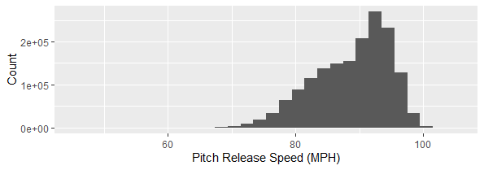
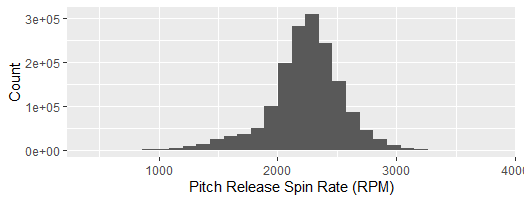

# Predicting Baseball Hitter Swing/Take/Whiff - Midterm Report
ORIE 4741 Course Project for FA20

Gary (Hancheng) Li

## Project Overview
The goal of this project is to predict whether a hitter in Major League Baseball will swing (and make contact), take, or whiff (swing and miss) at a certain pitch, based on the hitter's hitting tendencies, the pitch characteristics, as well as the game situation (number of outs in an inning, number of runners on base). Ideally, I hope to build a model that can suggest to the pitcher what types of pitches to use against a certain hitter, as well as finding out the most important factors that influence swing/take/miss which can help with prospect scouting and development.

This project primarily uses R v4.0.3 as the coding language.

## Dataset Preparation
The original dataset is obtained from the [Baseball Savant](https://baseballsavant.mlb.com/) website using its powerful Statcast search feature. This dataset is maintained by Major League Baseball R&D Department, and contains detailed play-by-play information from the 2019 MLB Regular Season. Each row corresponds to a single pitch thrown, while the columns contain information such as player IDs, player handedness, pitch type, pitch location, pitch velocity, spin rate, batted ball type, and other numeric, nominal or descriptive variables. The full list of variables are listed [here](https://baseballsavant.mlb.com/csv-docs). The original dataset is loaded into the R environment using the `baseballr` package developed by Bill Petti ([link](http://billpetti.github.io/baseballr/)), and contains 2,207,255 rows and 86 columns.

The dataset is well maintained with very few data quality issues. For the data cleaning process, I removed several deprecated columns including `spin_dir`, `break_angle_deprecated`, etc., corresponding to metrics that are no longer tracked and used. I also removed columns that I believe are irrelevant to the prediction, including `des` (which is the full description of each play, such as "Mike Trout homers (1) on a fly ball to center field"), and `umpire` (which is supposed to be the home plate umpire but the entire column is empty). Apart from this, the only issue I found with the dataset is that there are some pitches that were thrown with 3 outs already recorded in the inning, which is impossible to happen based on the rules of the game (if 3 outs have already been recorded then the inning immediately stops, any pitch can only be thrown with 0, 1, or 2 outs recorded). I removed these rows from the dataset. The processed dataset now has 1,651,065 rows and 41 columns.

Next, I coded the response variable column ("swing", "take", or "whiff") using the `description` column. There are 17 different types of events in the `description` column. I first removed all the rows related to bunts, since they are not considered as typical swings where the batter reacts to the pitch thrown. Then, I categorized the remaining types of events into "swing", "take" and "whiff" accordingly. The distribution of the three classes are shown below, we can see that approximately half of the pitches were taken, and the other half were swung at, and it's relatively difficult to induce a swing-and-miss.

Additionally, to capture the "hitting tendency" of the hitter, I performed data manipulation on the current dataset to obtain information about the historical swing/take/whiff percentages for each hitter in each zone. The `zone` column in the dataset is a column with integral values from 1 to 14, corresponding to 14 sections within and around the strike zone (as seen in this [zone chart](./Pics/zone.png)). I grouped by different players and aggregated their performances for each zone, for example, a player has a 0.543 swing rate, 0.348 take rate, and 0.109 whiff rate in zone 1. This information is added as additional columns to the dataset and used as predictors.

Finally, I prepared an alternative dataset with the same information, but performed one-hot encoding on the categorical variables, as well as standardizing all the columns for them to have mean 0 and variance 1. This alternative dataset has 67 columns and is used for specific algorithms that require only numeric columns and standardized values. I also divided the dataset into a 80%-20% training-test split using the `createDataPartition` function from the `caret` package. Data pre-processing is complete at this point.

*Below are the histogram plots for pitch speed and pitch spin rate from the processed dataset, two of the very important factors in determining swing/take/whiff behavior, based on previous sabermetric analyses.*

## Initial Models

For the initial model fitting, I tried out two relatively simple models: K-Nearest Neighbor and Multinomial Logistic Regression. To avoid under- or overfitting, I used the training dataset to train both models and used 5-fold cross validation to estimate the testing error while testing out different values for parameters. Because of limited computing power, I only took a 100,000-row subset of the training set to train the following models, to have a general sense of how the models are performing.

#### KNN Model
There is only one parameter to tune, which is `k`, the number of nearest neighbors. I tested out 10 different `k` values, with `k=21` being the model with the best CV accuracy at 65.1%. Using this model on the test set yielded a test accuracy rate of 65.3%.

#### Multinomial Logistic Regression
I used the `multinom` function from the `nnet` package, which is linear multinomial logistic regression. There is only one parameter to tune, which is `decay`, a penalty essentially the same as lambda from l2 regularization. Training the model yields 69.3% CV classification accuracy with `decay=0.1`, which is better than the KNN model. Using this model on the hold out test set produced an accuracy of 69.04%.

## Next Steps
Going forward with the project, there are a few things I plan to do:
* Figure out better ways to represent hitter tendency: there are some players with very few plate appearances, so the swing/take/whiff percentages might be very rough and inaccurate. Shall I include them in the dataset or not? I will have to test to find out.
* Build multiple different models with different subsets of columns selected and compare. This way, I can understand how including (or not including) different factors influence the quality of the model.
* Build a more complex and robust model using the XGBoost algorithm, and fine tune the model by testing out multiple different combinations of parameters.
* Dig deeper to analyze the results by investigating the following: How are the models performing on different classes? Is the accuracy rate for one class noticeably better/worse than another? How is the model performing for different pitch types, or different locations around the strike zone?
* Based on the previous questions, make pretty plots to visualize the results.
